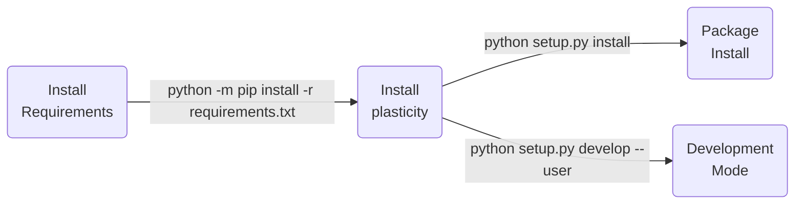
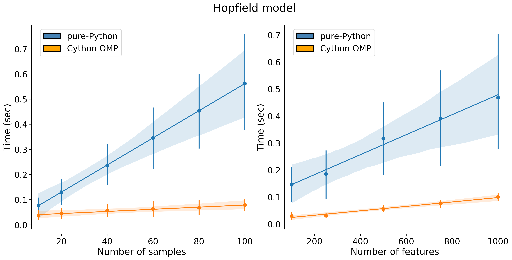

| **Authors**  | **Project** |  **Documentation** | **Build Status** | **Code Quality** |
|:------------:|:-----------:|:------------------:|:----------------:|:----------------:|
| [**N. Curti**](https://github.com/Nico-Curti) <br/> [**L. Squadrani**](https://github.com/lorenzosquadrani) <br/> [**S. Gasperini**](https://github.com/SimoneGasperini) <br/> [**M. Ceccarelli**](https://github.com/Mat092)  | **plasticity** <br/> [](https://www.mdpi.com/1099-4300/24/5/682) | [](https://github.com/Nico-Curti/plasticity/actions/workflows/docs.yml) <br/> [](https://plasticity.readthedocs.io/en/latest/?badge=latest) | [](https://github.com/Nico-Curti/plasticity/actions/workflows/windows.yml) <br/> [](https://github.com/Nico-Curti/plasticity/actions/workflows/linux.yml) <br/> [](https://github.com/Nico-Curti/plasticity/actions/workflows/macos.yml) <br/> [](https://github.com/Nico-Curti/plasticity/actions/workflows/python.yml) | [](https://www.codacy.com/gh/Nico-Curti/plasticity/dashboard?utm_source=github.com&amp;utm_medium=referral&amp;utm_content=Nico-Curti/plasticity&amp;utm_campaign=Badge_Grade) <br/> [](https://codebeat.co/projects/github-com-nico-curti-plasticity-main) |

**Appveyor:** [](https://ci.appveyor.com/project/Nico-Curti/plasticity-9jr6a/branch/main)

[](https://github.com/Nico-Curti/plasticity/pulls)
[](https://github.com/Nico-Curti/plasticity/issues)

[](https://github.com/Nico-Curti/plasticity/stargazers)
[](https://github.com/Nico-Curti/plasticity/watchers)

<a href="https://github.com/UniboDIFABiophysics">
  <div class="image">
    
  </div>
</a>

# Plasticity

## Unsupervised Neural Networks with biological-inspired learning rules

Implementation and optimization of biological-inspired Neural Network models for the features encoding.

* [Overview](#overview)
* [Theory](#theory)
* [Prerequisites](#prerequisites)
* [Installation](#installation)
* [Efficiency](#efficiency)
* [Usage](#usage)
* [Testing](#testing)
* [Table of contents](#table-of-contents)
* [Contribution](#contribution)
* [References](#references)
* [FAQ](#faq)
* [Authors](#authors)
* [License](#license)
* [Acknowledgments](#acknowledgments)
* [Citation](#citation)

## Overview

Despite the great success of back-propagation algorithm in deep learning, a question remains to what extent the computational properties of artificial neural networks are comparable to the plasticity rules of the human brain.
Indeed, even if the architectures of real and artificial neural networks are similar, the supervised training based on back-propagation and the neurobiology learning rules are unrelated.

In the paper by [D. Krotov and J. J. Hopfield](https://arxiv.org/abs/1806.10181), it is proposed an unusual learning rule, which has a degree of biological plausibility and which is motivated by different well known ideas in neuroplasticity theory:

* Hebb's rule: changes of the synapse strength depend only on the activities of the pre- and post-synaptic neurons and so the learning is **physically local** and describable by local mathematics

* the core of the learning procedure is **unsupervised** because it is believed to be mainly observational, with few or no labels and no explicit task

Starting from these concepts, they were able to design an algorithm (based on an extension of the *Oja rule*) capable of learning early feature detectors in a completely unsupervised way and then use them to train higher-layer weights in a usual supervised neural network.
In particular, the Hopfield model has the structure of a 2-layers neural network which can be described by the following equations:

<p align="center">
  
</p>

<p align="center">
  
</p>

where

<p align="center">
  
</p>

is the activation function of the unsupervised layer (ReLu for n=1), v<sub>i</sub>, h<sub>j</sub>, c<sub>k</sub> are respectively the input, hidden and output neurons and w<sub>ij</sub>, s<sub>jk</sub> are the receptive fields of the hidden layer (learned by the local unsupervised algorithm) and the weights learned by conventional supervised technique.

## Theory

In this project, a parallel approach founded on the same concepts is proposed.
In particular, it has been developed a model based on the *BCM theory* (E. Bienenstock, L. Cooper, and P. Munro).
An exhaustive theoretical description is provided by the original paper of [Castellani et al.](https://pubmed.ncbi.nlm.nih.gov/10378187/).
The proposed implementation is discussed in the work of [Squadrani & Curti et al.](https://www.mdpi.com/1099-4300/24/5/682).

In general terms, BCM model proposes a sliding threshold for long-term potentiation (LTP) or long-term depression (LTD) induction, and states that synaptic plasticity is stabilized by a dynamic adaptation of the time-averaged post-synaptic activity.
The BCM learning rule is described by the following equations:

<p align="center">
  
</p>

<p align="center">
  
</p>

where  is the time-average operator and, taking the input `x`, the output `y` is computed as:

<p align="center">
  
</p>

In the classical model the activation function  is a given by a sigmoid.

See [here](https://github.com/Nico-Curti/plasticity/blob/main/docs/source/theory.rst) for further details about the models.

## Prerequisites

C++ supported compilers:


The `plasticity` project is written in `C++` using simple c++14 features.
The package installation can be performed via [`CMake`](https://github.com/Nico-Curti/plasticity/blob/main/CMakeLists.txt).

The only requirement for the installation of the `C++` library is the `Eigen3` library.
You can easily install the `Eigen3` library with the following commands:

| **OS**       |  **Command**                      |
|:------------:|:----------------------------------|
| **Linux**    | `sudo apt install libeigen3-dev`  |
| **MacOS**    | `brew install eigen`              |
| **Windows**  | `vcpkg install eigen3`            |

| :triangular_flag_on_post: Note |
|:-------------------------------|
| For Windows users we suggest to use [`vcpkg`](https://github.com/microsoft/vcpkg) for the library installation/management. |

| :triangular_flag_on_post: Note |
|:-------------------------------|
| You can easily `Eigen3` install the library from source at this [link](https://gitlab.com/libeigen/eigen.git) to get the latest (more efficient) release. |

If you want visualize the model weights you have to build the library with the `-DVIEW:BOOL=ON`: in this case the `OpenCV` support is required for the installation.

The `CMake` installer provides also a `plasticity.pc`, useful if you want link to the `plasticity` using `pkg-config`.

You can also use the `plasticity` package in `Python` using the `Cython` wrap provided inside this project.
The only requirements are the following:

* numpy >= 1.15
* cython >= 0.29
* scikit-learn >= 0.20.3
* tqdm
* matplotlib

The `Cython` version can be built and installed via `CMake` enabling the `-DPYWRAP` variable.
The `Python` wrap guarantees also a good integration with the other common Machine Learning tools provided by `scikit-learn` `Python` package; in this way you can use the `plasticity` algorithm as an equivalent alternative also in other pipelines.
Like other Machine Learning algorithm also the `plasticity` one depends on many parameters, i.e its hyper-parameters, which has to be tuned according to the given problem.
The `Python` wrap of the library was written according to `scikit-optimize` `Python` package to allow an easy hyper-parameters optimization using the already implemented classical methods.

## Installation

A complete list of instructions "for beginners" is also provided for both [c++](https://github.com/Nico-Curti/plasticity/blob/main/docs/source/CMake.rst) and [python](https://github.com/Nico-Curti/plasticity/blob/main/docs/source/Python.rst) versions.

### CMake C++ installation

We recommend to use `CMake` for the installation since it is the most automated way to reach your needs.
First of all make sure you have a sufficient version of `CMake` installed (3.9 minimum version required).
If you are working on a machine without root privileges and you need to upgrade your `CMake` version a valid solution to overcome your problems is provided [here](https://github.com/Nico-Curti/Shut).

With a valid `CMake` version installed first of all clone the project as:

```bash
git clone https://github.com/Nico-Curti/plasticity
cd plasticity
```

The you can build the `plasticity` package with

```bash
mkdir -p build
cd build && cmake .. && cmake --build . --target install
```

`plasticity` could be built with the *build* scripts in the project, as:

|              |  **Linux**    |  **MacOS**    |  **Windows**  |
|:------------:|:--------------|:--------------|:--------------|
| **Script**   | `./build.sh`  | `./build.sh`  | `./build.ps1` |

The `CMake` command line can be customized according to the following parameters:

* `-DOMP:BOOL` : Enable/Disable the OpenMP support for multi-threading computation
* `-DBUILD_DOCS:BOOL` : Enable/Disable the build of docs using Doxygen and Sphinx
* `-DPYWRAP:BOOL` : Enable/Disable the build of Python wrap of the library via Cython (see next section for Python requirements)
* `-DBUILD_TEST:BOOL` : Enable/Disable the build of C++ testing scripts
* `-DVERBOSE:BOOL` : Enable/Disable the progress bar during training epochs
* `-DVIEW:BOOL` : Enable/Disable the visualization of neurons' weights during training

| :warning: WARNING |
|:------------------|
| The `-DVIEW:BOOL` option is available **only** with the support of OpenCV library! Pay attention to install it before the building of the library! |

| :triangular_flag_on_post: Note |
|:-------------------------------|
| The only requirement of the library is `Eigen3`. Please pay attention to install this dependency before running the CMake installation to avoid any issue. |

| :triangular_flag_on_post: Note |
|:-------------------------------|
| We support all the versions of the `Eigen3` library but we strongly recommend a version >= 3.3.90. |

| :triangular_flag_on_post: Note |
|:-------------------------------|
| If you want enable the `Cython` support compile the library with `-DPYWRAP=ON`. The `Cython` packages will be compiled and correctly positioned in the `plasticity` Python package **BUT** you need to run also the setup before use it. An alternative is to install the `Python` package directly with the setup script: in this way the `CMake` is called inside the package building and all the dependencies automatically checked. |

### Python installation

Python version supported : 

The `Python` installation can be performed with or without the `C++` installation.
The `Python` installation is always executed using [`setup.py`](https://github.com/Nico-Curti/DNetPRO/blob/master/setup.py) script.

If you have already build the `plasticity` `C++` library the installation is performed faster and the `Cython` wrap directly links to the last library installed.
Otherwise the full list of dependencies is build.

In both cases the installation steps are:



| :warning: WARNING |
|:------------------|
| The installation of the `Python` modules requires the `CMake` support and all the listed above libraries.<br>If you are working under *Window OS* we require the usage of `VCPKG` for the installation of the libraries and a precise configuration of the environment variables.<br>In particular you need to set the variables `VCPKG_ROOT=/path/to/vcpkg/rootdir/` and `VCPKG_DEFAULT_TRIPLET=x64-windows`.<br>A full working example of OS configuration can be found in the CI actions of the project, available [here](https://github.com/Nico-Curti/plasticity/blob/main/.github/workflows/) |

| :warning: WARNING |
|:------------------|
| All the `CMake` flags are set internally in the `setup.py` script with default values.<br>You can manually turn on/off the multi-threading support passing the flag `--omp` at the setup command line, *i.e.* `python setup.py develop --user --omp` |

| :triangular_flag_on_post: Note |
|:-------------------------------|
| The requirement of the `Eigen3` library is mandatory also for the `Cython` installation! Make sure to have installed all the requirements before running the `setup.py` command. |

## Efficiency

| BCM | Hopfield |
| --- | -------- |
|  |  |
| Comparison of time performances between the pure-`Python` implementation and `Cython` version of the `BCM` model varying the input dimension sizes (number of samples and number of features). For each input configuration 10 runs of both algorithm were performed keeping fixed all the other parameters. In the simulation we used 10 epochs and a SGD optimization algorithm. | Comparison of time performances between the pure-`Python` implementation and `Cython` version of the `Hopfield` model varying the input dimension sizes (number of samples and number of features). For each input configuration 10 runs of both algorithm were performed keeping fixed all the other parameters. In the simulation we used 10 epochs and a SGD optimization algorithm. |

We test the computational efficiency of both the implementation (pure-`Python` and `Cython` with multi-threading enabled).
The tests were performed keeping fixed all the training parameters and varying just the input dimension (number of samples and number of features).

As expected we have the most significant improvements enlarging the number of samples, while varying the number of features the scalability of the code is quite stable.
Both the algorithms spend the same time for the simulations and therefore their use is not constrained by any computational limitation.
We however encourage the use of the `Cython` version since it is obviously faster than the `Python` counterpart.

## Usage

You can use the `plasticity` library into pure-Python modules or inside your C++ application.

### C++ Version

The easiest usage of `plasticity` library is given by the two examples provided in the [example](https://github.com/Nico-Curti/plasticity/blob/main/example) folder.
Lets see in detail how you can use the models.

**Load the MNIST dataset** (ref. [run_mnist](https://github.com/Nico-Curti/plasticity/blob/main/example/run_mnist.cpp))

First of all you need to load your dataset.
In all the [example](https://github.com/Nico-Curti/plasticity/blob/main/example) scripts we use the MNIST digit dataset as toy model.
The `plasticity` library provides a simple class object for the MNIST dataset loading called `data_loader :: MNIST`: this object class allows to load both training and testing images/labels binary files related to the MNIST dataset.
The core implementation was inspired to the [`mnist`](https://github.com/wichtounet/mnist) package: in the original project folder you can also find the required binary files for the MNIST dataset.

The [`run_mnist`](https://github.com/Nico-Curti/plasticity/blob/main/example/run_mnist.cpp) allows also the visualization of a subset of images sampled by the MNIST dataset using the OpenCV support.
You can enable the OpenCV support building the library with the `-DVIEW:BOOL=ON` define.

The most important thing to take in mind is that all the `plasticty` models work with a 1D buffer of floating-point data as input.
In the MNIST dataset case this buffer of data is already exposed by the `data_loader :: MNIST` class as the "ravel" buffer of image pixels.

| :warning: WARNING |
|:------------------|
| For sake of clarity the `data_loader :: MNIST` class exposes a `uint8_t` buffer of data which must be converted into a floating-point buffer. |

**Load the CIFAR-10 dataset** (ref. [`run_cifar10`](https://github.com/Nico-Curti/plasticity/blob/main/example/run_cifar10.cpp))

The same procedure proposed for the MNIST dataset can be applied also for the CIFAR-10 dataset.
A specialization of `data_loader :: BaseData` class (mother class also of the `MNIST` object) provides an equivalent interface for the management of the CIFAR-10 dataset.
The `data_loader :: CIFAR10` class allows to load both training and testing images/labels binary files related to the CIFAR-10 dataset.
The core implemenation was inspired to the [`cifar-10`](https://github.com/wichtounet/cifar-10/) package.
The set of APIs and member functions/variables are the same of the `MNIST` class.

| :warning: WARNING |
|:------------------|
| The train/test data include in the same file both labels and images. The required format of the binary file is the same of the original implementation of the CIFAR-10 dataset (available [here](https://www.cs.toronto.edu/~kriz/cifar.html)). In the current implementation we have just concatenate together the full set of batch-files! |

**Train the model** (ref. [run_bcm_mnist](https://github.com/Nico-Curti/plasticity/blob/main/example/run_bcm_mnist.cpp))

The [`run_bcm_mnist`](https://github.com/Nico-Curti/plasticity/blob/main/example/run_bcm_mnist.cpp) and [`run_hopfield_mnist`](https://github.com/Nico-Curti/plasticity/blob/main/example/run_hopfield_mnist.cpp) scripts show two possible usage-examples of the BCM and Hopfield models, respectively.
The model simulations can be performed using a simple configuration file as the following one:

```
# Dataset parameters

MNIST_training_image = /path/to/train-images-idx3-ubyte
MNIST_training_label = /path/to/train-labels-idx1-ubyte
MNIST_testing_image = /path/to/t10k-images-idx3-ubyte
MNIST_testing_label = /path/to/t10k-labels-idx1-ubyte
normalize = 1
binarize = 0

# Model parameters

outputs = 100
batch_size = 1000
epochs_for_convergency = 100000
convergency_atol = 1e10
interaction_strength = 0.0
seed = 42
epochs = 20
weights_decay = 0.0

# BCM
memory_factor = 0.9

# Hopfield
p = 4
delta = 0.4
k = 2

# Activation function

activation = relu

# Optimizer parameters

optimizer = sgd
learning_rate = 2e-2
momentum = 0.9
decay = 0
B1 = 0.9
B2 = 0.999
rho = 0.0

# Weights parameters

weights = normal
mean = 0.0
std = 1.0
scale = 1.0
weights_seed = 42
```

The configuration file includes all the required parameters for the model training and the instructions related to the MNIST dataset.
The usage of the configuration file is not mandatory for the model usage but strongly recommended for the reproducibility.

The model initialization is performed for all the `plasticity` models into the constructors.
In particular, the BCM model is defined as

```c++
BCM (const int & outputs, const int & batch_size, int activation=transfer_t :: logistic,
     update_args optimizer=update_args(optimizer_t :: sgd),
     weights_initialization weights_init=weights_initialization(weights_init_t :: normal),
     int epochs_for_convergency=1, float convergency_atol=1e-2f,
     float decay=0.f, float memory_factor=0.5f,
     float interaction_strength=0.f)
```

while the Hopfield model is defined as

```c++
Hopfield (const int & outputs, const int & batch_size,
          update_args optimizer=update_args(optimizer_t :: sgd),
          weights_initialization weights_init=weights_initialization(weights_init_t :: normal),
          int epochs_for_convergency=1, float convergency_atol=1e-2f,
          float decay=0.f,
          float delta=.4f, float p=2.f,
          int k=2)
```

ref. to the [documentation](https://plasticity.readthedocs.io/en/latest/cppAPI/modules.html) for a deeper explanation of the model parameters.

After the model initialization the core of the simulation is performed inside the `fit` member-function.
The function signature is the following:

```c++
template < class Callback = std :: function < void (BasePlasticity *) > >
void fit (float * X, const int & n_samples, const int & n_features, const int & num_epochs, int seed=42, Callback callback=[](BasePlasticity *){});
```

where `X` is the buffer of data (in ravel format) and (`n_samples`, `n_features`) is the shape of the `X` matrix.
The last variable of the function is a (possible) `callback` function which takes the model object as input.
This function will be called as each batch subdivision and for each epoch of the training.
In the example we use as `callback` function a lambda-function for the visualization of the neurons weight matrix.

In summary, a minimal working example of a simulation on the MNIST dataset can be written as

```c++
#include <mnist.h>
#include <bcm.h>

int main (int argc, char ** argv)
{
  data_loader :: MNIST dataset;
  dataset.load_training_images(training_file);

  std :: unique_ptr < float [] > training(new float[dataset.train_size()]);

  for (int i = 0; i < dataset.train_size(); ++i)
    training[i] = static_cast < float >(dataset.training_images[i]) / 255.f;

  BCM bcm (100, 100, transfer_t :: relu, update_args(optimizer_t :: adam),
           weights_initialization(weights_init_t :: he_normal));

  bcm.fit(training.get(), dataset.num_train_sample, dataset.rows * dataset.cols, 10);
  bcm.save_weights("BCM_MNIST_simulation.bin")

  return 0;
}
```

### Python Version

The `plasticity` classes are totally equivalent to a `scikit-learn` feature-encoder object and thus they provide the member functions `fit` (to train your model) and `predict` (to test a trained model on new samples).
First of all you need to import the desired `plasticity` model.
The you can call the `fit` member function with the desired parameters.

| :triangular_flag_on_post: Note |
|:-------------------------------|
| Following the scikit-learn philosophy all the class parameters (a lot of possible parameters!) are initialized by default values. In this way you can build the object without any preliminary knowledge about the model. However, we strongly recommend to read the full list of possible variables using the `help` command. |

```python
from plasticity.model import BCM
from plasticity.model.optimizer import Adam
from plasticity.model.weights import HeNormal

from sklearn.datasets import fetch_openml

# Download the MNIST dataset
X, y = fetch_openml(name='mnist_784', version=1, data_id=None, return_X_y=True)

# normalize the sample into [0, 1]
X *= 1. / 255

model = BCM(outputs=100, num_epochs=10, batch_size=100, interaction_strength=0.,
            optimizer=Adam(lr=1e-3), activation='relu', weights_init=HeNormal())
model.fit(X)
```

Now you have trained the model on the MNIST digit dataset and thus the internal neurons have reached a precise configuration state.
You can easily visualize the neuron-weights matrix using the (utility) function `view_weights` provided by the `utils` submodule.

```python

from plasticity.utils import view_weights

view_weights (model.weights, dims=(28, 28))
```

The results should appear like this

|  |
| -- |
| Weights learned by 100 arbitrarily chosen BCM neurons after convergence on MNIST dataset. The bitmap shows the progression of neurons synapses starting from a random configuration (initial condition) along 10 training epochs. |

| :triangular_flag_on_post: Note |
|:-------------------------------|
| The above image was generated by a series of simulations! The `view_weights` function just plots the final version of the weights matrix. You can obtained an animation plot of the neuron convergency using the C++ version of the code with an appropriated callback function (ref. [here](https://github.com/Nico-Curti/plasticity/blob/main/example/run_bcm.cpp) for an example code) or with a little hack of the library code. We intentionally do not provide a callback support in the Python version of the model since its user interface must be as much as possible equivalent to a scikit-learn object. |

## Testing

`plasticity` uses CMake to build a full list of tests.
You can enable/disable tests setting the `-DBUILD_TEST:BOOL=ON` during the building.
All the test are performed using the [`Catch2`](https://github.com/catchorg/Catch2/) (v2.11.0) library.

The test scripts can be found [here](https://github.com/Nico-Curti/plasticity/blob/main/testing).
You can easily run the full list of C++ tests using the scripts [run_test.sh](https://github.com/Nico-Curti/plasticity/blob/main/testing/run_test.sh) and [run_test.ps1](https://github.com/Nico-Curti/plasticity/blob/main/testing/run_test.ps1) if you are working on a Unix-like or Windows machine, rispectively.

## Table of contents

Description of the folders related to the `C++` version.

| **Directory**                                                           |  **Description**                                                                          |
|:-----------------------------------------------------------------------:|:------------------------------------------------------------------------------------------|
| [hpp](https://github.com/Nico-Curti/plasticity/blob/main/hpp)           | Implementation of the C++ template functions and objects used in the `plasticity` library |
| [include](https://github.com/Nico-Curti/plasticity/blob/main/include)   | Definition of the C++ function and objects used in the `plasticity` library               |
| [src](https://github.com/Nico-Curti/plasticity/blob/main/src)           | Implementation of the C++ functions and objects used in the `plasticity` library          |

Description of the folders related to the `Python` version.

| **Directory**                                                                      |  **Description**                                                               |
|:----------------------------------------------------------------------------------:|:-------------------------------------------------------------------------------|
| [example](https://github.com/Nico-Curti/plasticity/blob/main/plasticity/example)   | `Jupyter` notebook with some examples on the MNIST (digit) dataset.            |
| [lib](https://github.com/Nico-Curti/plasticity/blob/main/plasticity/lib)           | List of `Cython` definition files                                              |
| [source](https://github.com/Nico-Curti/plasticity/blob/main/plasticity/source)     | List of `Cython` implementation objects                                        |
| [model](https://github.com/Nico-Curti/plasticity/blob/main/plasticity/model)       | pure-`Python` implementation of the classes                                    |
| [cython](https://github.com/Nico-Curti/plasticity/blob/main/plasticity/cython)     | `Cython`-wraps of the classes                                                  |

## Contribution

Any contribution is more than welcome :heart:. Just fill an [issue](https://github.com/Nico-Curti/plasticity/blob/main/.github/ISSUE_TEMPLATE/ISSUE_TEMPLATE.md) or a [pull request](https://github.com/Nico-Curti/plasticity/blob/main/.github/PULL_REQUEST_TEMPLATE/PULL_REQUEST_TEMPLATE.md) and we will check ASAP!

See [here](https://github.com/Nico-Curti/plasticity/blob/main/.github/CONTRIBUTING.md) for further informations about how to contribute with this project.

## References

<blockquote>1- Squadrani L, Curti N, Giampieri E, Remondini D, Blais B, Castellani G. Effectiveness of Biologically Inspired Neural Network Models in Learning and Patterns Memorization. Entropy. 2022; 24(5):682. https://doi.org/10.3390/e24050682 </blockquote>

<blockquote>2- Castellani G., Intrator N., Shouval H.Z., Cooper L.N. Solutions of the BCM learning rule in a network of lateral interacting nonlinear neurons, Network Computation in Neural Systems, https://doi.org/10.1088/0954-898X/10/2/001. </blockquote>

<blockquote>3- Blais B., Shouval H., Cooper L.N. Time Dependence of Visual Deprivation: A Comparison between Models of Plasticity and Experimental Results, Psychology, 1996, https://doi.org/10.21236/ada316967. </blockquote>

<blockquote>4- Blais B. DEMONSTRATION Plasticity: A Synaptic Modification Simulation Environment, 1986, https://github.com/bblais/plasticity </blockquote>

<blockquote>5- Yeung, Luk Chong and Blais, B.S. and Cooper, L.N and Shouval, Harel, Metaplasticity and the Unified Calcium Model Lead to Input Selectivity in Spiking Neurons (February 2003). Science Direct Working Paper No S1574-034X(04)70246-X, Available at SSRN: https://ssrn.com/abstract=2978356 </blockquote>

<blockquote>6- Blais B., Cooper L.N. BCM theory (January 2008), https://doi.org/10.4249/scholarpedia.1570 </blockquote>

<blockquote>7- Dmitry Krotov, and John J. Hopfield. Unsupervised learning by competing hidden units, PNAS, 2019, www.pnas.org/cgi/doi/10.1073/pnas.1820458116. </blockquote>

## FAQ

* **How can I properly set the C++ compiler for the Python installation?**

If you are working on a Ubuntu machine pay attention to properly set the environment variables related to the `C++` compiler.
First of all take care to put the compiler executable into your environmental path:

```bash
ls -ltA /usr/bin | grep g++
```

Then you can simply use the command to properly set the right aliases/variables

```bash
export CXX=/usr/bin/g++
export CC=/usr/bin/gcc
```

but I suggest you to put those lines into your `.bashrc` file (one for all):

```bash
echo "export CC=/usr/bin/gcc" >> ~/.bashrc
echo "export CXX=/usr/bin/g++" >> ~/.bashrc
```

I suggest you to not use the default `Python` compiler (aka `x86_64-linux-gnu-g++`) since it can suffer of many issues during the compilation if it is not manually customized.

| :triangular_flag_on_post: Note |
|:-------------------------------|
| If you are working under Windows OS a complete guide on how to properly configure your MSVC compiler can be found [here](https://github.com/physycom/sysconfig). |

* **I installed the `plasticity` Python package following the instructions but I have an `ImportError` when I try to import the package as in the examples**

This error is due a missing environment variable (which is not automatically set by the installation script).
All the `C++` libraries are searched into the OS directory tree starting from the information/paths hinted by the `LD_LIBRARY_PATH` environment variable.
When you install the `plasticity` library the produced `.so`, `.dll`, `.dylib` files are saved into the `lib` directory created into the project root directory.
After the installation you must add this directory into the searching path.
You can add this information editing the configuration file of your `Unix`-like system, i.e

```bash
echo "export LD_LIBRARY_PATH=$LD_LIBRARY_PATH:/path/to/plasticity/project/directory/lib/" >> ~/.bashrc
echo "export DYLD_LIBRARY_PATH=$DYLD_LIBRARY_PATH:/path/to/plasticity/project/directory/lib/" >> ~/.bashrc
```

or adding the `LD_LIBRARY_PATH` to your set of environment variables (especially for `Windows` users).

* **Where can I find the binary files related to the MNIST dataset?**

You can get the binary files of the MNIST dataset at this [link](https://github.com/wichtounet/mnist).
The object class implemented in the `plasticity` library was inspired to the (original) implementation provided by the author of the above repository.
You can just download (or clone) the repository and move the file wherever you want, paying attention to use the correct path to the example scripts.

* **Where can I find the binary files related to the CIFAR-10 dataset?**

You can get the binary files of the CIFAR-10 dataset at this [link](https://www.cs.toronto.edu/~kriz/cifar.html).
The object class implemented in the `plasticity` library was inspired to the (original) implementation provided [here](https://github.com/wichtounet/cifar-10/).
For a more user-friendly interface we consider a processed version of the original set of files for our simulation.
The original data are split into 5 files related to 5 different batches.
Furthermore, the stored images are in CHW format (ref. [here](https://www.cs.toronto.edu/~kriz/cifar.html) for the file format description).

To obtain a version of the data compatible with the `plasticity` library you need to concatenate the full list of files (`data_batch_*.bin`) and transpose the images into HWC format (OpenCV compatible).
You can manually perform this transformation or just use the following snippet:

```python
import numpy as np
import struct

filenames = ['path/to/data_batch_{:d}.bin'.format(i) for i in range(6)]

labels = []
images = []
w, h, c = (32, 32, 3)

for file in filenames:
  with open(file, 'rb') as fp:
    buffer = fp.read()
    data_batch = struct.unpack('B'*(c*h*w*10000 + 10000), buffer)
    data_batch = np.asarray(data_batch)

    label = data_batch[0::c*h*w + 1]

    image = np.delete(data_batch, np.arange(0, data_batch.size, w*h*c + 1))
    image = image.reshape(10000, c, h, w).transpose(0, 2, 3, 1)

  images.append(image)
  labels.append(label)

images = np.concatenate(images).astype('uint8')
labels = np.concatenate(labels).astype('uint8')

with open('/path/to/whole_train_cifar10.bin', 'wb') as fp:
  for lbl, img in zip(labels, images):
    fp.write(struct.pack('B', lbl))
    fp.write(struct.pack('B'*h*w*c, *img.ravel()))
```

* **How can I install the library via `VCPKG` dependency manager?**

The `plasticity` library is not yet supported via `vcpkg` (I have not submitted any PR yet).
However, in the [`cmake`](https://github.com/Nico-Curti/plasticity/blob/master/cmake) folder you can find a complete directory-tree named `vcpkg`.
You can simply copy&paste the entire `vcpkg` folder over the original (cloned [here](https://github.com/microsoft/vcpkg)) project to manage the entire installation of the library *also* via vcpkg.

| :triangular_flag_on_post: Note |
|:-------------------------------|
| Since no releases have been published yet, the [`portfile`](https://github.com/Nico-Curti/plasticity/blob/master/cmake/ports/plasticity/portfile.cmake) is not complete and you need to manually set the `REF` and `SHA512` variables! |

## Authors

*  **Nico Curti** [git](https://github.com/Nico-Curti), [unibo](https://www.unibo.it/sitoweb/nico.curti2)

*  **Lorenzo Squadrani** [git](https://github.com/lorenzosquadrani)

*  **Simone Gasperini** [git](https://github.com/SimoneGasperini)

*  **Mattia Ceccarelli** [git](https://github.com/Mat092), [unibo](https://www.unibo.it/sitoweb/mattia.ceccarelli5/)

See also the list of [contributors](https://github.com/Nico-Curti/plasticity/contributors) [](https://github.com/Nico-Curti/plasticity/graphs/contributors/) who participated in this project.

## License

The `plasticity` package is licensed under the MIT "Expat" License. [](https://github.com/Nico-Curti/plasticity/blob/main/LICENSE)

## Acknowledgments

Thanks goes to all contributors of this project.

We thank also the author(s) of [Catch2](https://github.com/catchorg/Catch2) library: we have used it in the testing procedure of our C++ version and it is amazing!

## Citation

If you have found `plasticity` helpful in your research, please consider citing the original paper


```BibTex
@article{10.3390/e24050682,
  author = {Squadrani, Lorenzo and Curti, Nico and Giampieri, Enrico and Remondini, Daniel and Blais, Brian and Castellani, Gastone},
  title = {Effectiveness of Biologically Inspired Neural Network Models in Learning and Patterns Memorization},
  journal = {Entropy},
  volume = {24},
  year = {2022},
  number = {5},
  article-NUMBER = {682},
  url = {https://www.mdpi.com/1099-4300/24/5/682},
  pubmedid = {35626566},
  issn = {1099-4300},
  doi = {10.3390/e24050682}
}
```

or just this repository

```BibTeX
@misc{plasticity,
  author = {Curti, Nico and Squadrani, Lorenzo and Gasperini, Simone and Ceccarelli, Mattia},
  title = {plasticity - Unsupervised Neural Networks with biological-inspired learning rules},
  year = {2020},
  publisher = {GitHub},
  howpublished = {\url{https://github.com/Nico-Curti/plasticity}}
}
```
